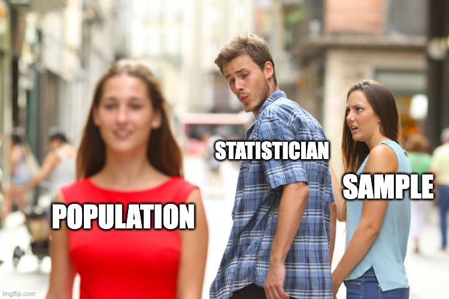
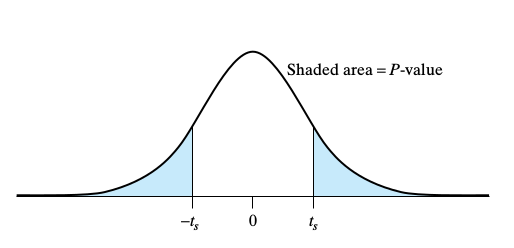

```{r, eval=TRUE, include=TRUE, echo=FALSE, message=FALSE, warning=FALSE}
# regarding `library()`: you don't have to `library(knitr)` if you `knitr::`
knitr::opts_chunk$set(eval=TRUE, include=TRUE, echo=TRUE, message=FALSE, warning=FALSE)

# knitting will default to pdf (rather than, e.g., html)
knitr::opts_chunk$set(dev='pdf')

# Defines a new code chunk `parameter=argument` option which will allow the
# size of printed code+output to be controlled using latex text size names:
# https://www.overleaf.com/learn/latex/Font_sizes%2C_families%2C_and_styles#Reference_guide
def.chunk.hook  <- knitr::knit_hooks$get("chunk")
knitr::knit_hooks$set(chunk = function(x, options) {
  x <- def.chunk.hook(x, options)
  ifelse(options$size != "normalsize", paste0("\n \\", options$size,"\n\n", x, "\n\n \\normalsize"), x)
})

color_block = function(color) {
  function(x, options) sprintf('\\color{%s}\\begin{verbatim}%s\\end{verbatim}',
                               color, x)
}
knitr::knit_hooks$set(message = color_block('red'))
knitr::knit_hooks$set(warning = color_block('red'))
knitr::knit_hooks$set(error = color_block('red'))
```

## (Theoretical) Populations VS (Actual) Samples

### Manually flip a coin 10 times and record the outcomes, or...


```{r, eval=FALSE}
set.seed(130); for(i in 1:10){
  sample(c("H","T"), size=1)#cat(sample(c("H","T"), size=1));cat(" ")
}
```
```{r, echo=FALSE}
set.seed(130)
for(i in 1:10){
  cat(sample(c("H","T"), size=1)); cat(" ")
}; cat("\n\n")
```

\vspace{-.5cm}
### 

Or...

```{r}
sample(c("H","T"), size=10, p=c(1/2,1/2), replace=TRUE)
```

\vspace{-.5cm}
### 

- `p` *defaults* to "equal chances", so `p=c(1/2,1/2)` isn't strictly required
- Why is `replace=TRUE` *critically important* in conjunction with `size=10`?
  
  
  
## (Theoretical) Populations VS (Actual) Samples

### Manually flip a coin 10 times and record the outcomes, or...


\vspace{-.25cm}

:::columns
::::column

  
```{r, eval=FALSE}
set.seed(130); for(i in 1:10){
  sample(c("H","T"), size=3)
}
```
```{r, echo=FALSE}
set.seed(130)
for(i in 1:10){
  sample(c("H","T"), size=1)
}; print(" ")
```
::::
::::column

  \vspace{.15cm}
  
  \color{red}
  \footnotesize
  
  \texttt{Error in sample.int(length(x), size, replace, prob) : }
  
  \texttt{cannot take a sample larger than the population when 'replace = FALSE'}
  
\vspace{-.15cm}

::::
:::

  \normalsize
  
\vspace{-.5cm}
### 

Or...

```{r}
sample(c("H","T"), size=10, p=c(1/2,1/2), replace=TRUE)
```

\vspace{-.5cm}
### 

- `p` *defaults* to "equal chances", so `p=c(1/2,1/2)` isn't strictly required
- Why is `replace=TRUE` *critically important* in conjunction with `size=10`?
  
    
```{r, eval=FALSE, include=FALSE}
download.file(url = "https://online.stat.psu.edu/public/stat800/lesson04/InferenceGraphicSU17.png",
              destfile = "images/samplepop.png", mode = 'wb')
download.file(url = "https://i.imgflip.com/6of17u.jpg",
              destfile = "images/boyfriend.jpg", mode = 'wb')
```

## (Theoretical) Populations VS (Actual) Samples

\begin{center}
\includegraphics[trim=10 20 10 20,clip, width=.6\textwidth]{images/samplepop.png}
\end{center}

## (Theoretical) Populations VS (Actual) Samples

| |
|-|
|{width=350px}|


## (Theoretical) Populations VS (Actual) Samples

### The $\bar x$ Sample `mean()` statistic \textcolor{gray}{(lower case)}


:::columns
::::column

```{r, warning=TRUE, size="footnotesize"}
n <- 4
set.seed(130)
x <- sample(c("Heads","Tails"), size=n,
            p=c(1/2,1/2), replace=TRUE)

xbar <- mean(x)
```

\color{black}

```{r, size="footnotesize"}
mean(as.numeric(factor(x)))
xbar <- mean(as.numeric(factor(x))-1)
xbar
```

::::
::::column

```{r, size="footnotesize"}
x
as.factor(x)
```

\vspace{1cm}

```{r, size="footnotesize"}
as.numeric(as.factor(x))
as.numeric(as.factor(x))-1
```

::::
:::

## (Theoretical) Populations VS (Actual) Samples

### The ***Sampling Distribution*** VS $\bar x$ the Sample `mean()` statistic \textcolor{gray}{(lower case)} 

```{r, eval=FALSE}
N <- 100#00000000000?
n <- 10 # <- What's this?
simulated_xbars <- 1:N # <- What's this?
set.seed(130) # <- What happens if this goes inside the for loop?
for(i in 1:N){
  simulated_x <- sample(c("Heads","Tails"), size=n, p=c(1/2,1/2), 
                        replace=TRUE)
  simulated_xbar <- mean(2-as.numeric(as.factor(simulated_x)))  
                  # mean(as.numeric(as.factor(simulated_x))-1) ?
  simulated_xbars[i] <- simulated_xbar
} # What do we have in `simulated_xbars` once the for loop completes?
```


## (Theoretical) Populations VS (Actual) Samples

### The ***Sampling Distribution*** VS $\bar x$ the Sample `mean()` statistic \textcolor{gray}{(lower case)} 

:::columns
::::column

```{r, size="footnotesize"}
n <- 50; N<-10000; simulated_xbars<-1:N
set.seed(42); for(i in 1:N){
  sim_x <- sample(c("Heads","Tails"), 
      size=n, p=c(1/2,1/2), replace=TRUE)
  sim_x <- 2-as.numeric(as.factor(sim_x))
  simulated_xbars[i] <- mean(sim_x) 
}
```

```{r, eval=FALSE, size="footnotesize"}
tibble("xbar"=simulated_xbars) %>% 
  ggplot(aes(x=xbar)) + 
  xlim(0,1) + geom_histogram(bins=51) 
# IGNORE the warning "Removed 2 rows 
# containing missing values (geom_bar)."
```

::::
::::column

```{r, eval=FALSE, size="footnotesize"}
# {r, fig.width=2.5, fig.height=1.5}
library(tidyverse)
```
```{r, echo=FALSE, fig.width=2.5, fig.height=1.5}
library(tidyverse)
tibble("xbar"=simulated_xbars) %>% 
  ggplot(aes(x=xbar)) + xlim(0,1) +
  geom_histogram(bins=51)
```

::::
:::


## (Theoretical) Populations VS (Actual) Samples

### The ***Sampling Distribution*** VS $\bar x$ the Sample `mean()` statistic \textcolor{gray}{(lower case)} 
- What would make these observed statistic possible?

```{r, echo=FALSE, fig.width=5.5, fig.height=2}
library(tidyverse)
# {r, fig.width=5.5, fig.height=2.25}
tibble("xbar"=simulated_xbars) %>% 
  ggplot(aes(x=xbar)) + xlim(0,1) +
  geom_histogram(bins=51) + 
  geom_vline(aes(xintercept=0.52, color='0.52')) +
  geom_vline(aes(xintercept=0.60, color='0.60')) +
  geom_vline(aes(xintercept=0.68, color='0.68')) +
  geom_vline(aes(xintercept=0.72, color='0.72')) +
  geom_vline(aes(xintercept=0.77, color='0.77')) +
  geom_vline(aes(xintercept=0.95, color='0.95')) +
  scale_color_manual(name="xbars", values=c(`0.52`="green", `0.60`= "blue", 
                    `0.68`="purple", `0.72`="yellow", `0.77`="orange", `0.95`="red"))
# color hack: https://stackoverflow.com/questions/37660694/add-legend-to-geom-vline
```


## (Theoretical) Populations VS (Actual) Samples

### The ***Sampling Distribution*** VS $\bar x$ the Sample `mean()` statistic \textcolor{gray}{(lower case)} 
- What would make these observed statistic possible?

```{r, echo=FALSE, fig.width=5.5, fig.height=2}
library(tidyverse)
# {r, fig.width=5.5, fig.height=2.25}
tibble("xbar"=simulated_xbars) %>% 
  ggplot(aes(x=xbar)) + xlim(0,1) +
  geom_histogram(bins=51) + 
  geom_vline(aes(xintercept=0.48, color='0.48')) +
  geom_vline(aes(xintercept=0.40, color='0.40')) +
  geom_vline(aes(xintercept=0.32, color='0.32')) +
  geom_vline(aes(xintercept=0.28, color='0.28')) +
  geom_vline(aes(xintercept=0.23, color='0.23')) +
  geom_vline(aes(xintercept=0.05, color='0.05')) +
  scale_color_manual(name="xbars", values=c(`0.48`="green", `0.40`= "blue", 
                    `0.32`="purple", `0.28`="yellow", `0.23`="orange", `0.05`="red"))
# color hack: https://stackoverflow.com/questions/37660694/add-legend-to-geom-vline
```


## (Theoretical) Populations VS (Actual) Samples

```{r, eval=FALSE, include=FALSE}
download.file(url = "https://memegenerator.net/img/instances/58324118.jpg",
              destfile = "images/didthathappen1.jpg", mode = 'wb')
download.file(url = "https://media.makeameme.org/created/wow-did-that-828bf72040.jpg",
              destfile = "images/didthathappen2.jpg", mode = 'wb')
```

| | |
|-|-|
|{height=230px}|{width=175px}|


## (Theoretical) Populations VS (Actual) Samples

### The ***Sampling Distribution*** VS $\bar x$ the Sample `mean()` statistic \textcolor{gray}{(lower case)} 

```{r, echo=FALSE, fig.width=12, fig.height=5}
p <- c(.05,.23,.28,.32,.40,.48,.52,.6,.68,.72,.76,.95)
color <- c("red","orange","yellow","purple","blue","green","green","blue","purple","yellow","orange","red") 
ggplots <- as.list(rep(NA, length(p)))
n <- 50; N <- 1000; simulated_xbars <- 1:N
set.seed(42)
for(j in 1:length(p)){
  for(i in 1:N){
    x <- sample(c("Heads","Tails"), size=n, p=c(p[j],1-p[j]), replace=TRUE)
    simulated_xbars[i] <- mean( 2-as.numeric(as.factor(x)) ) 
  }
  tibble("xbar"=simulated_xbars) %>% ggplot(aes(x=xbar)) + xlim(0,1) +
    geom_histogram(bins=51) + geom_vline(xintercept=p[j], color=color[j]) +
    ggtitle(paste("If Probability of Heads is", p[j])) -> ggplots[[j]]
}

gridExtra::grid.arrange(grobs=ggplots, nrow=3)
# https://cran.r-project.org/web/packages/egg/vignettes/Ecosystem.html
# https://cran.r-project.org/web/packages/gridExtra/vignettes/arrangeGrob.html
```

## (Theoretical) Populations VS (Actual) Samples

### The ***Sampling Distribution*** VS $\bar x$ the Sample `mean()` statistic \textcolor{gray}{(lower case)} 

```{r, echo=FALSE, fig.width=12, fig.height=5}
p <- c(.05,.23,.28,.32,.40,.48,.52,.6,.68,.72,.76,.95)
color <- c("red","orange","yellow","purple","blue","green","green","blue","purple","yellow","orange","red") 
ggplots <- as.list(rep(NA, length(p)))
n <- 250; N <- 1000; simulated_xbars <- 1:N
set.seed(42)
for(j in 1:length(p)){
  for(i in 1:N){
    x <- sample(c("Heads","Tails"), size=n, p=c(p[j],1-p[j]), replace=TRUE)
    simulated_xbars[i] <- mean( 2-as.numeric(as.factor(x)) ) 
  }
  tibble("xbar"=simulated_xbars) %>% ggplot(aes(x=xbar)) + xlim(0,1) +
    geom_histogram(bins=51) + geom_vline(xintercept=p[j], color=color[j]) +
    ggtitle(paste("If Probability of Heads is", p[j])) -> ggplots[[j]]
}

gridExtra::grid.arrange(grobs=ggplots, nrow=3)
# https://cran.r-project.org/web/packages/egg/vignettes/Ecosystem.html
# https://cran.r-project.org/web/packages/gridExtra/vignettes/arrangeGrob.html
```

## (Theoretical) Populations VS (Actual) Samples

### The ***Sampling Distribution*** VS $\bar x$ the Sample `mean()` statistic \textcolor{gray}{(lower case)} 

```{r, echo=FALSE, fig.width=12, fig.height=5}
p <- c(.05,.23,.28,.32,.40,.48,.52,.6,.68,.72,.76,.95)
color <- c("red","orange","yellow","purple","blue","green","green","blue","purple","yellow","orange","red") 
ggplots <- as.list(rep(NA, length(p)))
n <- 25; N <- 1000; simulated_xbars <- 1:N
set.seed(42)
for(j in 1:length(p)){
  for(i in 1:N){
    x <- sample(c("Heads","Tails"), size=n, p=c(p[j],1-p[j]), replace=TRUE)
    simulated_xbars[i] <- mean( 2-as.numeric(as.factor(x)) ) 
  }
  tibble("xbar"=simulated_xbars) %>% ggplot(aes(x=xbar)) + xlim(0,1) +
    geom_histogram(bins=51) + geom_vline(xintercept=p[j], color=color[j]) +
    ggtitle(paste("If Probability of Heads is", p[j])) -> ggplots[[j]]
}

gridExtra::grid.arrange(grobs=ggplots, nrow=3)
# https://cran.r-project.org/web/packages/egg/vignettes/Ecosystem.html
# https://cran.r-project.org/web/packages/gridExtra/vignettes/arrangeGrob.html
```


## Statistical Inference and Hypothesis Testing

|**Statistical Inference** |
|-|
| Can we infer [some specific thing] from the data? |

\vspace{-.25cm}
- We'll be doing **Statistical Inference** in a specific way called **Hypothesis Testing**

\vspace{-.1cm}

|**Hypothesis Testing**|
|-|
|Could the observed data be plausibly generated under a given assumption?|

\vspace{-.25cm}
- We'll do **Hypothesis Testing** in a specific way with an $\alpha$-**significance level** test

\vspace{-.3cm}

\begin{center}
\begin{tabular}{l}
\\\hline
$\alpha$-\textbf{Significance Level Hypothesis Testing}\\\hline
$\alpha$ is the probability we make a wrong decision about a chosen assumption.\\\hline
\end{tabular}
\end{center}

## (Theoretical) Populations VS (Actual) Samples

### The ***Sampling Distribution*** VS $\bar x$ the Sample `mean()` statistic \textcolor{gray}{(lower case)} 

:::columns
::::column

### The NULL Hypothesis

\vspace*{-.25cm}
\large The *assumed value* of the **parameter**
\vspace*{-.5cm}
\LARGE $$\textcolor{blue}{H_0: p = 0.5}$$ \normalsize

\vspace*{-.25cm}
implying a **sampling distribution** to be

*compared against* the **observed test stat**

::::
::::column

### The ALTERNATIVE Hypothesis

\vspace{-1cm}
\LARGE
$$\textcolor{red}{H_1: p \not = 0.5} \;\text{or}\; \textcolor{red}{H_A: p \not = 0.5}$$
$$\text{or just}\; \textcolor{red}{H_1/H_A: H_0 \text{ is }\texttt{FALSE}}$$

\vspace{-.2cm}
::::
:::

### p-value

The probability \textcolor{gray}{[\emph{which can be approximated}]} of observing a test statistic that is

*as or more extreme* than the one we got **if the NULL Hypothesis is actually `TRUE`** 

## (Theoretical) Populations VS (Actual) Samples

### How to measure how ***unlikely*** these observations are?

```{r, echo=FALSE, fig.width=9, fig.height=3.5}
n <- 50; N<-10000; simulated_xbars<-1:N
set.seed(42); for(i in 1:N){
  sim_x <- sample(c("Heads","Tails"), 
      size=n, p=c(1/2,1/2), replace=TRUE)
  sim_x <- 2-as.numeric(as.factor(sim_x))
  simulated_xbars[i] <- mean(sim_x) 
}
library(latex2exp)
tibble("xbar"=simulated_xbars) %>% 
  ggplot(aes(x=xbar)) + xlim(0,1) +
  geom_histogram(bins=51) + 
  geom_vline(aes(xintercept=0.52, color='0.52')) +
  geom_vline(aes(xintercept=0.60, color='0.60')) +
  geom_vline(aes(xintercept=0.68, color='0.68')) +
  geom_vline(aes(xintercept=0.72, color='0.72')) +
  geom_vline(aes(xintercept=0.77, color='0.77')) +
  geom_vline(aes(xintercept=0.95, color='0.95')) +
  geom_vline(aes(xintercept=0.48, color='0.48')) +
  geom_vline(aes(xintercept=0.40, color='0.40')) +
  geom_vline(aes(xintercept=0.32, color='0.32')) +
  geom_vline(aes(xintercept=0.28, color='0.28')) +
  geom_vline(aes(xintercept=0.23, color='0.23')) +
  geom_vline(aes(xintercept=0.05, color='0.05')) +
  scale_color_manual(name="xbars", values=c(`0.48`="green", `0.40`= "blue", 
                    `0.32`="purple", `0.28`="yellow", `0.23`="orange", `0.05`="red",
                    `0.52`="green", `0.60`= "blue", 
                    `0.68`="purple", `0.72`="yellow", `0.77`="orange", `0.95`="red")) +
  ggtitle(TeX("Sampling Distribution of $\\bar{x}$ if $H_0: p=0.5$ is TRUE"))
# color hack: https://stackoverflow.com/questions/37660694/add-legend-to-geom-vline
```


## DO NOT MESS THIS UP (or else)

```{r, eval=FALSE, include=FALSE}
download.file(url = "https://miro.medium.com/max/1028/1*BgkawQccwLSwbMTMaTL9IQ.png",
              destfile = "images/pvalue.png", mode = 'wb')
download.file(url = "http://qed.econ.queensu.ca/walras/custom/300/351B/images/hyptest2.gif",
              destfile = "images/pvalue2.gif", mode = 'wb')
```

\vspace{-1.6in}

\begin{center}
\includegraphics[trim=75 65 0 0,clip, width=.8\textwidth]{images/pvalue2.png}
\end{center}

\vspace{-2.55in}
\colorbox{white}{\textcolor{blue}{\textbf{p-value:} "as or more extreme ($H_0$ \texttt{TRUE})" area}}

<!--  -->


## DO NOT MESS THIS UP (or else)

### p-value

The probability \textcolor{gray}{[\emph{which can be approximated}]} of observing a test statistic that is

*as or more extreme* than the one we got **if the NULL Hypothesis is actually `TRUE`** 

### Not a p-value: ~~The probability of the **Null Hypothesis** is `TRUE`~~

***That's not how*** **Statistical Hypothesis Testing** ***works...***

\vspace{.15cm}
- The **NULL Hypothesis** *IS* either `TRUE` or *IS* `FALSE` (not both)

\vspace{.15cm}
- The **NULL Hypothesis** can't be *sometimes* `TRUE` and *sometimes* `FALSE`

\vspace{.15cm}
- The **NULL Hypothesis** can't be `TRUE` *for me* and `FALSE` *for you*

\vspace{-.3cm}

\begin{block}{}

Saying "\textbf{I put a $x\%$ chance on the \emph{Null Hypothesis} being} \texttt{TRUE}/\texttt{FALSE}" is 

$\longrightarrow \;$ using probability to express \emph{belief} rather than random chance.

\begin{itemize}
\item If you want to use probability to express \textbf{belief} then you'll need to be \emph{Bayesian}...
\end{itemize}

\end{block}

\vspace{-.3cm}


## DO NOT MESS THIS UP (or else)

\vspace{-1.6in}

\begin{center}
\includegraphics[trim=75 65 0 0,clip, width=.8\textwidth]{images/pvalue2.png}
\end{center}

\vspace{-2.55in}
\colorbox{white}{\textcolor{blue}{\textbf{p-value:} "as or more extreme ($H_0$ \texttt{TRUE})" area}}


## DO NOT MESS THIS UP (or else)

### p-value

The probability \textcolor{gray}{[\emph{which can be approximated}]} of observing a test statistic that is

*as or more extreme* than the one we got **if the NULL Hypothesis is actually `TRUE`** 

### Not a p-value: ~~The probability **parameter** is the NULL hypothesis value~~

***That's not how*** **Statistical Hypothesis Testing** ***works...***

\vspace{.15cm}
- The **NULL Hypothesis parameter** isn't a "random event"

\vspace{.15cm}
- The **NULL Hypothesis parameter** doesn't change values at different times

\vspace{.15cm}
- The **NULL Hypothesis parameter** isn't drawn from some "distribution"

\vspace{-.3cm}

\begin{block}{}

Except if you're \emph{Bayesian}, in which case you model \emph{belief} about \textbf{parameters} 

$\longrightarrow \;$ as distributions, and then \emph{do} make probability statements about \textbf{parameters}

\begin{itemize}
\item but this is a \emph{different} statistical paradigm than \textbf{Hypothesis Testing}
\end{itemize}

\end{block}

\vspace{-.3cm}


## DO NOT MESS THIS UP (or else)

\vspace{-1.6in}

\begin{center}
\includegraphics[trim=75 65 0 0,clip, width=.8\textwidth]{images/pvalue2.png}
\end{center}

\vspace{-2.55in}
\colorbox{white}{\textcolor{blue}{\textbf{p-value:} "as or more extreme ($H_0$ \texttt{TRUE})" area}}


## (Theoretical) Populations VS (Actual) Samples

### The ***Sampling Distribution*** VS $\bar x$ the Sample `mean()` statistic \textcolor{gray}{(lower case)} 

:::columns
::::column

```{r, size="footnotesize"}
n <- 50; N<-10000; simulated_xbars<-1:N
p <- 0.5 # <- This isn't "sometimes 0.5"
# The NULL Hypothesis and n are "fixed"
set.seed(42); for(i in 1:N){
  # Each flip is where there's p "chance"
  x <- sample(c("Heads","Tails"), size=n, 
              p=c(p,1-p), replace=TRUE)
  simulated_x<-2-as.numeric(as.factor(x))
  simulated_xbars[i] <- mean(simulated_x)
} # what are the following two values?
mean(abs(simulated_xbars-p)>=abs(0.65-p))
mean(abs(simulated_xbars-p)>=abs(0.68-p))
```

::::
::::column
```{r, size="footnotesize"}
# {r, fig.width=3.25, fig.height=2.5}
```
```{r, echo=FALSE, fig.width=3.25, fig.height=2.5}
tibble("xbar"=simulated_xbars) %>% 
  ggplot(aes(x=xbar)) + xlim(0,1) +
  geom_histogram(bins=51) + 
  geom_vline(xintercept=0.65, color="purple") +
  geom_vline(xintercept=0.68, color="red") +
  ggtitle("Simulated Sampling Distribution\nif the NULL Hypothesis is TRUE")
```

::::
:::

## Kissing the "Right" Way

```{r, eval=FALSE, include=FALSE}
download.file(url = "https://www.kazoart.com/blog/wp-content/uploads/2017/10/le-baiser-rodin-681x1024.jpg",
              destfile = "images/rodin.png", mode = 'wb')
```


:::columns
::::column

<!-- \hspace*{1cm}{width=175px} -->
\begin{center}
\includegraphics[width=.66\textwidth]{images/rodin.png}
\end{center}

::::
::::column

\vspace{.25cm}

$\longleftarrow$ Rodin's sculpture [The Kiss](https://en.wikipedia.org/wiki/The_Kiss_(Rodin_sculpture))

\vspace{1cm}

- [Güntürkün (2003)](https://www.nature.com/articles/news030210-7) recorded how kissing couples tilt their heads.

\vspace{.3cm}

- 80 out of 124 couples, or 64.5% tilted their heads to the right.

\vspace{.3cm}

- Would we reject a NULL hypothesis $H_0$ that the population of humans don't have left or right head tilt tendencies when kissing?

::::
:::


## Hypothesis Testing

1. State the **NULL Hypothesis** $H_0: p=0.5$ for the *population* [which is?]
\vspace{-.15cm}

    - Assume the value of the **parameter** of the **NULL Hypothesis** is `TRUE`
    - The **ALTERNATIVE Hypothesis** is just that the NULL Hypothesis is `FALSE`

2. Set an $\boldsymbol \alpha$**-significance level** which specifies a "$H_0$ rejection rule"
\vspace{-.15cm}

    - You will "Reject $H_0$ at the $\alpha$-significance level" for **p-values** less than $\alpha$
    - ***This is also the probability of a Type I error of "rejecting a true $H_0$ [Why?]***

3. For the sample size $n$ of the observed **test statistic**
\vspace{-.15cm}

    - Simulate the **Sampling Distribution** asumming the **NULL Hypothesis** is `TRUE`

4. Compute the **p-value** of the **observed test statistic**
\vspace{-.15cm}

   The probability \textcolor{gray}{[\emph{which can be approximated}]} of observing a test statistic that is
   *as or more extreme* than the one we got **if the NULL Hypothesis is actually `TRUE`**

5. "**Reject $H_0$ at the $\boldsymbol \alpha$-significance level**" if the **p-value** is less than $\alpha$
\vspace{-.15cm}

    - Otherwise, "**Fail to reject $H_0$ at the $\boldsymbol \alpha$-significance level**"


## Type I and II Errors in Hypothesis Testing

```{r, eval=FALSE, include=FALSE}
download.file(url = "https://vipinajayakumar.com/post/t-test/banner.jpg",
              destfile = "images/preg.jpg", mode = 'wb')
```


|              | **Innocent** | **Guilty**    | 
|--------------|--------------|---------------|
|**Convicted** | $\times$ Oops! Type I | $\checkmark$ Gotcha! Justice! |
|**Acquitted** | $\checkmark$ Justice! Freedome! | $\times$ Oops! Type II |

\vspace{-.5cm}

| |
|-|
|  |

## Type I and II Errors in Hypothesis Testing

```{r, eval=FALSE, include=FALSE}
download.file(url = "https://upload.wikimedia.org/wikipedia/en/e/ef/Panzer_General_Coverart.png",
              destfile = "images/pg.png", mode = 'wb')
download.file(url = "https://i.pinimg.com/originals/d9/ac/2d/d9ac2d58da5c794a83f34fa9f624f2df.jpg",
              destfile = "images/peace.jpg", mode = 'wb')
download.file(url = "https://images-na.ssl-images-amazon.com/images/I/81FzZRr-1LL.jpg",
              destfile = "images/fail.jpg", mode = 'wb')
```

This is weird, but... 

\vspace{-.25cm}
*this is how I remember the difference between Type I and Type II Errors...*

| because... | WW I $\rightarrow$  **Type I Error** | WW II $\rightarrow$ **Type II Error**  |
|:-:|:-:|:-:|
| {height=150px} | {height=150px} | {height=150px} | 

\vspace{-.5cm}
- WW I wrongly rejected $H_0: peace$ when it shouldn't have $\rightarrow$ **Type I Error**
- WW II appeasement failed to reject $H_0$ when it should have $\rightarrow$ **Type II Error**

## Type I and II Errors in Hypothesis Testing


\begin{block}{What's the NULL hypothesis in a Covid Test?}
\begin{itemize}
\item You don't have Covid? You probably have Covid?
\item What are the corresponding Type I and II Errors?
\end{itemize}
\end{block}

\begin{block}{Do people know the difference between covid-19 vs sars-cov 2?}
\begin{itemize}
\item What test statistic could we use?
\item What NULL hypothesis parameter could we use?
\end{itemize}
\end{block}

```{r, eval=FALSE, include=FALSE}
download.file(url = "https://www.peelpolice.ca/en/in-the-community/resources/Images/COVID-19-banner.jpg",
              destfile = "images/covid.jpg", mode = 'wb')
```


\vspace{-.5in}
\textcolor{white}{[ The kind of picture I get} 

\vspace{-.25cm}
\textcolor{white}{$\;\;$ when I image search Covid-19 ]}

## Two Sample Hypothesis Testing

### Can we follow the above steps for the following $H_0$?

\vspace{-1.5cm}
\Huge $$\textcolor{blue}{H_0: p_1 = p_2} \;\; \Longrightarrow \;\; \textcolor{red}{H_{1/A}: p_1 \neq p_2}$$

\vspace{-.25cm}
\large
- What kind of example problems could this represent? \textcolor{gray}{Treatment/Control?}

###

1. \normalsize [$\checkmark$] $\displaystyle \textcolor{blue}{H_0: p_1 = p_2} \;\; \Longrightarrow \;\; \textcolor{blue}{H_0: p_1 - p_2 = 0}$

2. [$\checkmark$] Choose **significance level** $\boldsymbol \alpha \; \mathbf{= 0.5}$

3. [$\checkmark$] Use ***observed test statistic*** $\bar x_1 - \bar x_2$ based on $n_1$ and $n_2$ samples 

    - [$\,$?$\,$] Simulate the **Sampling Distribution** asumming the **NULL Hypothesis** is `TRUE`

4. [$\checkmark$] Compute **p-value**

5. [$\checkmark$] Reject / Fail to reject $H_0$

## Two Sample Hypothesis Testing

```{r}
set.seed(13)
n1 <- 30; n2 <- 40; ns <- paste("n1=", n1, " and n2=", n2, sep="")
x1 <- sample(c(0,1), size=n1, replace=TRUE)
x2 <- sample(c(0,1), size=n2, p=c(1/3,2/3), replace=TRUE)
observed_test_statistic <- mean(x1)-mean(x2); observed_test_statistic

N <- 10000; permutation_test_statistics <- 1:N
set.seed(130); for(i in 1:N){
  shuffled_xs <- sample(c(x1,x2), size=n1+n2, replace=FALSE)
  tmp <- mean(shuffled_xs[1:n1])-mean(shuffled_xs[(n1+1):(n1+n2)])
  permutation_test_statistics[i] <- tmp
} # What does `permutation_test_statistics` assume about H_0?
```
```{r, size="footnotesize"}
mean(abs(permutation_test_statistics)>=abs(observed_test_statistic))
```

## Two Sample Hypothesis Testing

```{r, fig.width=7, fig.height=2.25, size="footnotesize"}
# {r, fig.width=6.5, fig.height=2.25}
tibble("xbar1-xbar2"=permutation_test_statistics) %>% 
  ggplot(aes(x=`xbar1-xbar2`)) + geom_histogram(bins=18) +
  xlim(-.5,.5) + geom_vline(xintercept=observed_test_statistic) +
  ggtitle(TeX(paste("Sampling Distribution of $\\bar{x}_1 - \\bar{x}_2$ for",
                    ns, "if $H_0: p_1=p_2$ is TRUE")))
```

## More General Hypothesis Testing

### $\bar x = \frac{1}{n}\sum x_i$ VS $\hat p = \frac{1}{n}\sum x_i$ (don't confuse with $p$ (don't confuse with ***p-value***) )

- We've considered $\frac{1}{n}\sum x_i$ when $x_i$ is $0$ or $1$ with probability $p$ and $1-p$, respectively
  - In this case, we often write $\hat p$ instead of $\bar x$ since $\hat p$, the observed proportion of $x_i$ that are $1$, estimates $p$, **NULL hypothesis parameter** chance that $x_i=1$

### $x_i \sim f(E[x_i]=\mu, \; \boldsymbol \theta)$, $E[x_i]=\mu$, and $H_0: \mu=m_0$ and $H_0: \mu_1-\mu_2=0$
  
- *Everything we did also works if $x_i$ has a different distribution of possible values*
  - **Not just when $x_i$ can only be $0$ or $1$**
  - A Gaussian distribution is a common example: $x_i \sim N\left(E[x_i]=\mu, \; SD[x_i]=\sigma\right)$

### `mean()` VS `median()`, `var()`, etc. 

$H_0: Median=m_0$ and $H_0: Median_1=Median_2$ and $H_0: \sigma^2=s^2_0$ and $H_0: \sigma^2_1=\sigma^2_2$

```{r, echo=FALSE}
library(latex2exp)# install.packages("latex2exp")
```

## $H_0: \mu=m_0$ $\;\;|\;\;\;$ $x_i \sim N\left(\mu, \; \sigma\right)$ $\;\;|\;\;\;$ $H_0: \mu_1=\mu_2\quad\;$ 
:::columns
::::column

```{r, size="footnotesize"}
n1 <- 10; N<-10000; simulated_xbars<-1:N
set.seed(130); x1 <- rnorm(mean=1, n=n1)
set.seed(42); for(i in 1:N){
  simulated_x <- rnorm(mean=0, n=n1)#H_0
  # sample(c(0,1), size=n, replace=TRUE)
  simulated_xbars[i] <- mean(simulated_x) 
}; mean(x1)
```
```{r, echo=FALSE, fig.height=2.75, fig.width=5.5}
tibble("xbar"=simulated_xbars) %>%
  ggplot(aes(x=xbar)) + geom_histogram() +
  geom_vline(xintercept=mean(x1)) +
  ggtitle(TeX(paste("Sampling Distribution of $\\bar{x}_1$ for n_1 =",
                    n1, "if $H_0: \\mu=0$ is TRUE")))
```

::::
::::column

```{r, size="footnotesize"}
n2 <- 15; permutation_test_statistics<-1:N
set.seed(131); x2 <- rnorm(mean=0, n=n2)
set.seed(43); for(i in 1:N){
  shuffled_xs <- sample(c(x1,x2), 
                 size=n1+n2,replace=FALSE)
  tmp <- mean(shuffled_xs[1:n1]) - 
         mean(shuffled_xs[(n1+1):(n1+n2)])
  permutation_test_statistics[i] <- tmp
}; mean(x1)-mean(x2)
```
```{r, echo=FALSE, fig.height=2.625, fig.width=7}
ns <- paste("n1=",n1," and n2=",n2,sep="")
tibble("xbar1-xbar2"=permutation_test_statistics) %>% 
  ggplot(aes(x=`xbar1-xbar2`)) + geom_histogram() +
  geom_vline(xintercept=mean(x1)-mean(x2)) +
  labs(title =TeX(paste("Sampling Distribution of $\\bar{x}_1-\\bar{x}_2$ for",
                        ns, "if $H_0: \\mu_0=\\mu_1$ is TRUE")))
```

::::
:::


##  $H_0$: Median=m$_0 \quad|\quad \underset{\%tile}{50^{th}} \quad|\quad H_0$: Median$_1$=Median$_2$\hspace*{-.75cm}

:::columns
::::column

```{r, size="footnotesize"}
n1 <- 10; N<-10000; simulated_xmeds<-1:N
set.seed(130); x1 <- rnorm(mean=1, n=n1)
set.seed(42); for(i in 1:N){
  simulated_x <- rnorm(mean=0, n=n1)#H_0
  # sample(c(0,1), size=n, replace=TRUE)
  simulated_xmeds[i] <- median(simulated_x) 
}; median(x1)
```
```{r, echo=FALSE, fig.height=2.5, fig.width=5}
tibble("xmed"=simulated_xmeds) %>% 
  ggplot(aes(x=xmed)) + geom_histogram() +
  geom_vline(xintercept=mean(x1)) +
  ggtitle(paste("Sampling Distribution of Median(x1) for n1 =",
                n1, "\nif H_0: Median=0 is TRUE"))
```

::::
::::column

```{r, size="footnotesize"}
n2 <- 15; permutation_test_statistics<-1:N
set.seed(131); x2 <- rnorm(mean=0, n=n2)
set.seed(43); for(i in 1:N){
  shuffled_xs <- sample(c(x1,x2), 
                 size=n1+n2,replace=FALSE)
  tmp <- median(shuffled_xs[1:n1]) - 
         median(shuffled_xs[(n1+1):(n1+n2)])
  permutation_test_statistics[i] <- tmp
}; median(x1)-median(x2)
```
```{r, echo=FALSE, fig.height=2.5, fig.width=6.5}
ns <- paste("n1=",n1," and n2=",n2,sep="")
tibble("xmed1-xmed2"=permutation_test_statistics) %>% 
  ggplot(aes(x=`xmed1-xmed2`)) + geom_histogram(bins=15) +
  geom_vline(xintercept=median(x1)-median(x2)) +
  ggtitle(paste("Sampling Distribution of Median(x1) - Median(2) for", 
                ns, "\nif H_0: Median_1=Median_2 is TRUE"))
```

::::
:::

## $H_0: \sigma^2=s^2_0$ $\;\;|\;\;$ $s^2 = \frac{\sum (x_i-\bar x)^2}{n-1}$ $\;|\;$ $H_0: \sigma^2_1=\sigma^2_2 \quad\quad$

:::columns
::::column

```{r, size="footnotesize"}
n1 <- 10; N<-10000; simulated_xvars<-1:N
set.seed(130); x1 <- rnorm(mean=1,sd=1.5,n=n1)
set.seed(42); for(i in 1:N){
  simulated_x <- rnorm(mean=0,sd=1,n=n1)#H_0
  # sample(c(0,1), size=n, replace=TRUE)
  simulated_xvars[i] <- var(simulated_x) 
}; var(x1)
```
```{r, echo=FALSE, fig.height=3, fig.width=6}
tibble("xvar"=simulated_xvars) %>% 
  ggplot(aes(x=xvar)) + geom_histogram() +
  geom_vline(xintercept=var(x1)) +
  ggtitle(TeX(paste("Sampling Distribution of var(x1) for n1 =",
                    n1, "if $H_0: \\sigma^2=1$ is TRUE")))
```

::::
::::column

```{r, size="footnotesize"}
n2 <- 15; permutation_test_statistics<-1:N
set.seed(131); x2 <- rnorm(mean=0, sd=1.2, n=n2)
set.seed(43); for(i in 1:N){
  shuffled_xs <- sample(c(x1,x2), 
                 size=n1+n2,replace=FALSE)
  tmp <- var(shuffled_xs[1:n1]) - 
         var(shuffled_xs[(n1+1):(n1+n2)])
  permutation_test_statistics[i] <- tmp
}; var(x1)-var(x2)
```
```{r, echo=FALSE, fig.height=3, fig.width=8}
ns <- paste("n1=",n1," and n2=",n2,sep="")
tibble("xvar1-xvar2"=permutation_test_statistics) %>% 
  ggplot(aes(x=`xvar1-xvar2`)) + geom_histogram() +
  geom_vline(xintercept=var(x1)-var(x2)) +
  ggtitle(TeX(paste("Sampling Distribution of var(x1)$ - $var(x2) for",
                    ns, "if $H_0: \\sigma^2_1=\\sigma^2_2$ is TRUE")))
```

::::
:::
